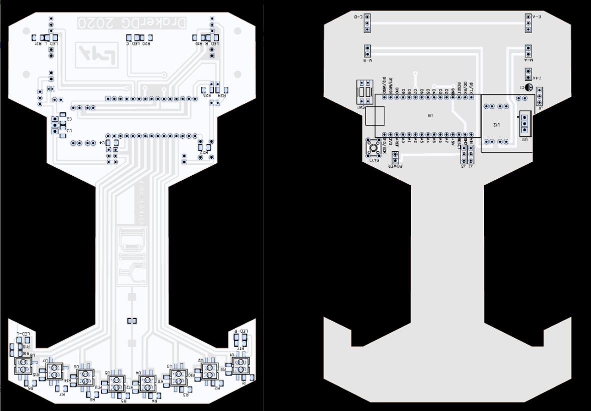

# 🤖 Line Follower Delivery Robot

## 🏆 Intro
This project is a **Line Follower Delivery Robot**, designed to autonomously follow lines and transport small items. It integrates a compact PCB, motors, sensors, and a 3D-printed chassis to create a fully functional delivery robot. The PCB is perfectly tailored for this purpose, simplifying wiring and ensuring stable power distribution.

##  🤝 Sponsorship 

This project is proudly **supported by [PCBWay](https://www.pcbway.com/)**. PCBWay provided prototyping support for the PCB, allowing both raw and assembled boards to be produced with high quality. Their service made it easy to bring this Line Follower Delivery Robot from design to reality.

## Visual Overview

## Key Features
- **Autonomous Line Following**: Detects and follows lines using IR sensors.
- **Compact PCB Design**: Minimal space required for easy integration into the chassis.
- **Motor & Sensor Integration**: Direct connections for DC motors and line sensors, reducing wiring complexity.
- **Stable Power Distribution**: Provides reliable voltage to all electronic components.
- **PCBWay Ready**: Fully compatible with PCBWay prototyping and assembly services.
- **Modular Code Structure**: Easy to modify and expand for different line-following behaviors.

## Components & Their Roles
- **Arduino Uno / Nano**: Handles sensor input, motor control, and executes the line-following algorithm.
- **Infrared Line Sensors (IR Modules)**: Detect black/white line patterns to guide the robot along the track.
- **DC Motors + Motor Drivers**: Powers the wheels, controlled via PWM by the microcontroller.
- **Battery / Power Supply**: Provides stable 5–7V for the PCB and motors.
- **PCB**: Central hub for power and signal distribution, connecting sensors, motors, and controller.
- **3D Printed Chassis**: Holds all components in place and ensures correct alignment of sensors and wheels.

## 3D Design
- Designed using **Tinkercad**.   
- Ensures precise alignment of motors, sensors, and PCB.  

## PCB Design
- Created using **EasyEDA**.  
- Includes footprints for sensors, motors, and power supply.  
- Optimized for minimal noise and stable voltage distribution.  
- Compatible with PCBWay prototyping and assembly services.  

## Code
- Written in **C++ for Arduino/ESP32**.  
- Implements line-following logic using sensor input.  
- Controls motors via PWM for smooth movement.  
- Modular structure: Sensor Reading → Algorithm → Motor Control.  
- Fully commented for easy understanding and modification.
