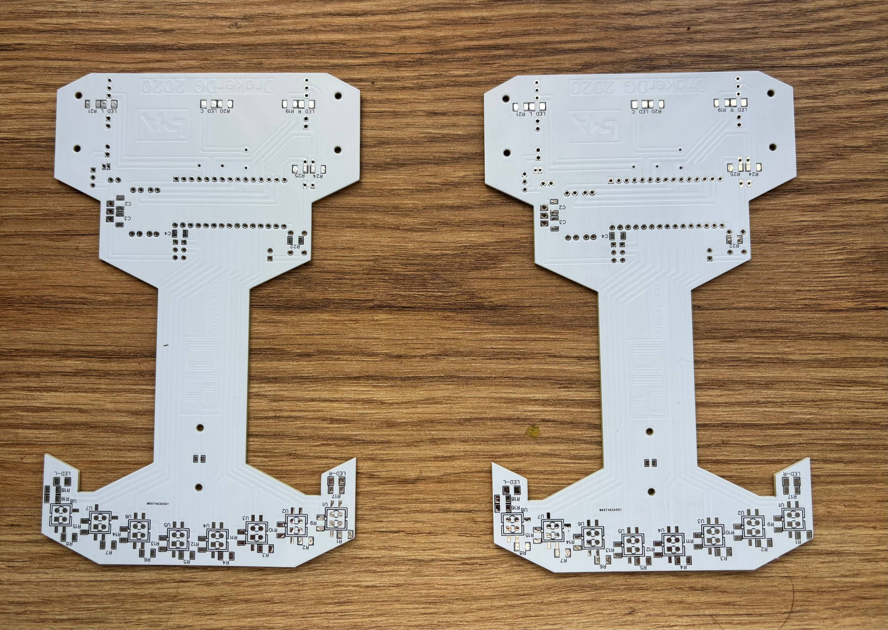
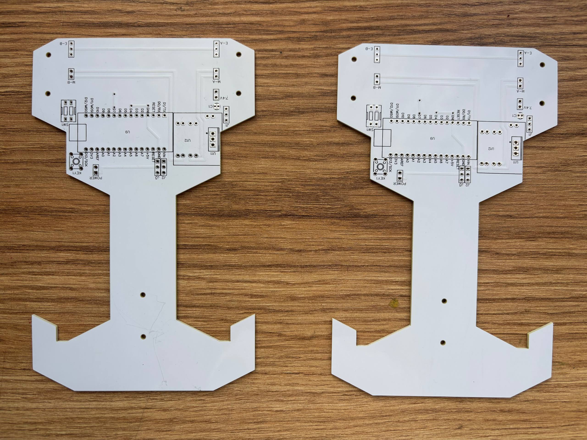
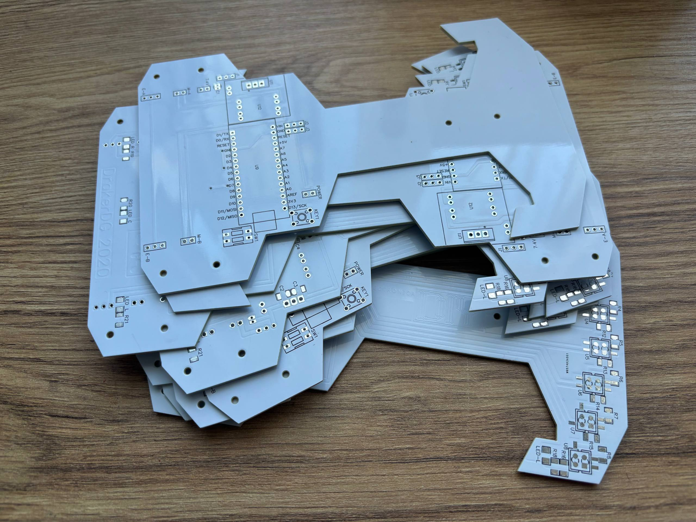

# 🤖 Line Follower Delivery Robot

*A compact autonomous robot that follows a line using IR sensors and PID control..built on Arduino*

---

## 📋 Overview

This project is a classic line follower robot designed as a learning platform for embedded systems and robotics. It features:

- **Microcontroller:** Arduino (Uno / Nano)
- **Sensors:** IR sensor array (typically 3–5 sensors)
- **Motor Driver:** L298N or similar H-bridge module
- **Algorithm:** PID (Proportional-Integral-Derivative) control for smooth line tracking
- **Language:** C++ (Arduino framework)

The robot reads IR sensor values, calculates the error (deviation from the line), and adjusts motor speeds accordingly to stay on track.

---

## ⚙️ How It Works

1. IR sensors detect the contrast between the black line and white surface
2. Sensor readings are combined to compute a position error
3. A PID controller calculates the correction needed
4. Motor speeds are adjusted to steer the robot back onto the line

---

## 🧊 3D Model

👆 *Click to open the interactive 3D viewer*

**[🔗 View on Sketchfab](https://sketchfab.com/3d-models/line-follower-robot-v1-306da242e85f45b7930ecfb5d24d8f65)**

---

## Sponsored by PCBWay

**This project is proudly sponsored by [PCBWay](https://www.pcbway.com)**
*One of the most popular and trusted PCB manufacturers for makers, students, and engineers worldwide*

PCBWay kindly sponsored the custom PCB for this line follower robot, manufacturing and shipping it to me completely free of charge. Here is my honest review:

---

#### 📸 The Boards - As Received

| Bottom side | Top / Component side |
|:-----------:|:--------------------:|
|  |  |

*All of the ten boards from the batch have identical quality, zero defects*

The boards arrived in a custom robot-chassis shape, which PCBWay cut with precision. The white soldermask finish is clean and consistent across both boards, the silkscreen text and component labels are crisp and easy to read, and every hole is exactly where it should be.

---

#### 🔬 PCB Quality Breakdown

| Criteria | Result |
|---|---|
| **Trace accuracy** | ✅ All traces clean, no bridges or shorts |
| **Hole drilling** | ✅ Holes perfectly aligned with footprints |
| **Soldermask** | ✅ Smooth, even finish with no peeling or bubbling |
| **Silkscreen** | ✅ Labels crisp, readable, and accurately placed |
| **Board dimensions** | ✅ Exact match to my design files |
| **Batch consistency** | ✅ Both boards identical — zero defects |
| **Overall finish** | ✅ Professional look, comparable to commercial products |

When I soldered my components, everything fit perfectly, through-hole components seated flush, and the pads took solder cleanly. Not a single board from the batch had any defect.

---

#### 📦 Ordering & Delivery

The ordering process on [pcbway.com](https://www.pcbway.com) was straightforward. I uploaded my Gerber files, selected my specifications (color, thickness, quantity), and the order was confirmed quickly. Their team reached out proactively to verify my files before production, which shows attention to detail.

Shipping was fast, and the boards arrived safely packaged, with no damage whatsoever.

---

#### 💬 My Verdict

> *"If you're a hobbyist, student, or engineer looking for reliable PCB manufacturing at a great price, I genuinely recommend PCBWay. The quality I received was on par with boards you'd find in commercial products, and the experience from upload to delivery was smooth and hassle-free."*

They offer a lot more than just PCBs too:

| Service | Details |
|---|---|
| 🖨️ **PCB Manufacturing** | 1–20 layers, quick-turn prototype to mass production |
| 🛠️ **PCB Assembly** | SMT & through-hole, with component sourcing |
| 🖨️ **3D Printing** | SLA, FDM, SLS — great for robot chassis & enclosures |
| 🔧 **CNC Machining** | Precision parts for mechanical builds |
| ⚡ **Fast turnaround** | As fast as 24 hours for prototypes |
| 🌍 **Worldwide shipping** | DHL, FedEx and more |

👉 **[Get your own PCBs manufactured at pcbway.com](https://www.pcbway.com)**

---

## 📐 Schematic

---

## 🛠️ Hardware

| Component | Description |
|---|---|
| Arduino Uno/Nano | Main microcontroller |
| IR Sensor Array | Line detection (3–5 sensors) |
| L298N Motor Driver | Controls the two DC motors |
| DC Motors (x2) | Drive wheels |
| Li-Po / 18650 Battery | Power supply |
| Custom PCB | Manufactured by **[PCBWay](https://www.pcbway.com)** |

---

## 📄 License

This project is open source under the [MIT License](LICENSE).
